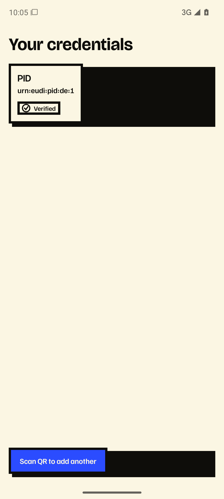
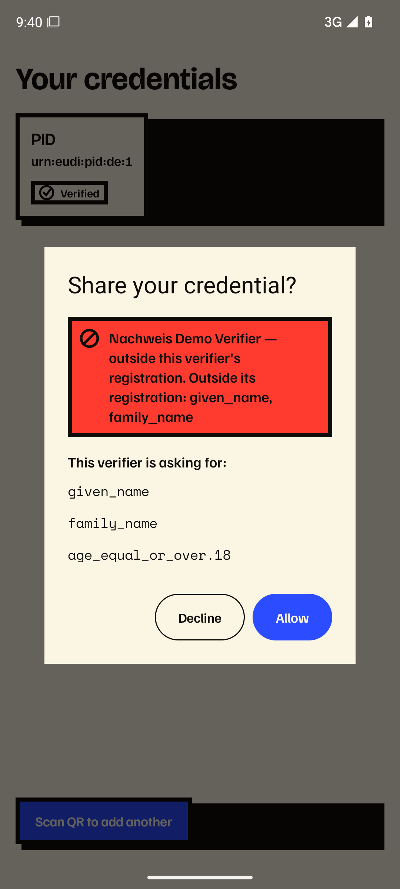
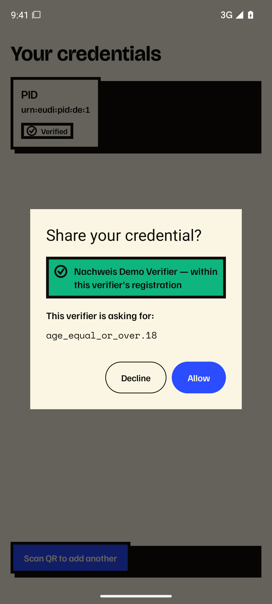
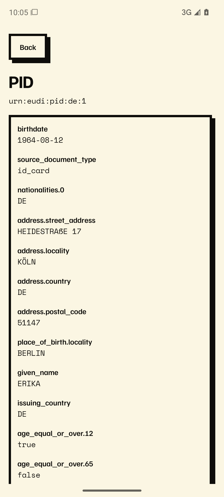

# nachweis Android

An Android EUDI wallet prototype built on the official EUDI wallet libraries
(`eudi-lib-android-wallet-core`). It issues and holds an SD-JWT PID and verifies relying-party
requests, with a flagship focus on **registration-aware consent**: the wallet checks a verifier's
request against its ETSI TS 119 475 registration certificate (WRPRC) and flags claims that fall
outside what the verifier is registered for.

Verified end-to-end against a deployed sandbox (issuer, verifier, and trust/status artifacts):

- **Issuance** — pre-authorized OpenID4VCI, SD-JWT PID (`urn:eudi:pid:de:1`), stored under
  `noBackupFilesDir` with a Keystore key that requires user authentication.
- **Presentation** — OpenID4VP with full signed-request validation (JAR `x5c` path to a trust
  anchor, `client_id` binding), constrained DCQL.
- **Flagship D1** — WRPRC verification (`typ=rc-wrp+jwt`, JAdES B-B; CWT rejected), WRPAC/WRPRC
  status via signed lists refreshed off the consent path, and a verdict that names any claim
  **"outside this verifier's registration"** (never "over-ask"). Consent evaluation makes zero
  network calls.

## Screenshots

All data shown is the standard German test persona (Erika Mustermann), issued by the public
sandbox issuer. The two consent dialogs are the same wallet talking to the same verifier: the
root endpoint over-asks (`given_name`, `family_name` are outside its registration certificate),
the `/age/` endpoint asks only for `age_equal_or_over.18` and passes.

| Credential list | Consent: outside registration | Consent: within registration | Credential detail |
|---|---|---|---|
|  |  |  |  |

## Toolchain

minSdk 26, JDK 17, AGP 9.2.1 (built-in Kotlin toolchain), `eudi-lib-android-wallet-core` 0.28.1.
Product flavors `demo` (targets the public sandbox) and `production`; build types `debug`/`release`.

## Live issuance and the wallet-core interop patch

`main` pins the **official released** `eudi-lib-android-wallet-core:0.28.1`. That release cannot
finish issuance against a spec-compliant OpenID4VCI issuer that returns RAR `authorization_details`
with `credential_identifiers` (the deployed EUDIPLO does): `SubmitRequest` always builds a
configuration-based credential request, which `openid4vci-kt` then rejects. This is upstream bug
[#353](https://github.com/eu-digital-identity-wallet/eudi-lib-android-wallet-core/issues/353); the
fix is upstream PR
[#369](https://github.com/eu-digital-identity-wallet/eudi-lib-android-wallet-core/pull/369).

`main` intentionally stays on the official release rather than shipping a fork. For live issuance
demonstrations, the upstream fix (PR #369) is applied to a local checkout of the official `v0.28.1`
and consumed through a local Maven repository; `main` never consumes the patched artifact (a
vendored variant was proposed in [PR #1](https://github.com/nachweis/nachweis-android/pull/1) and
closed unmerged). `main` will resume tracking an official release once the fix ships. Details:
[`docs/interop-walletcore.md`](docs/interop-walletcore.md).

## Notes

Trust material in the `demo` flavor is a self-managed demo bundle, not an official registrar. Live
verification so far is on an emulator (no StrongBox/real-hardware run yet). Private planning,
strategy, raw session exports, and deployment details live in the separate private `nachweis-docs`
repo; this repo is app code only.
